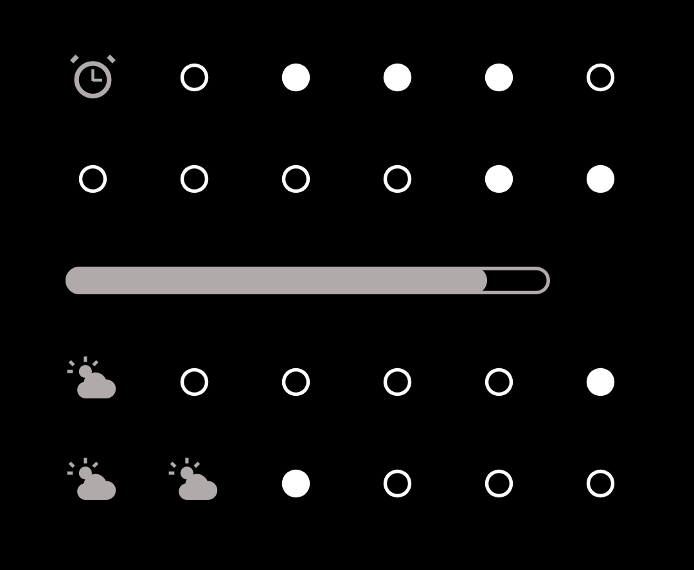
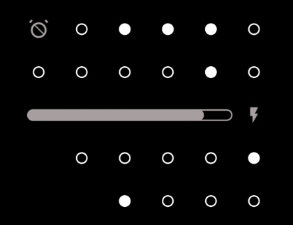
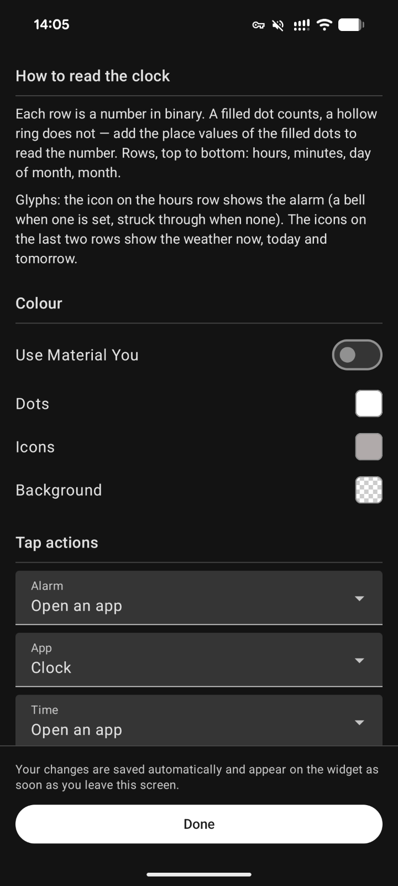
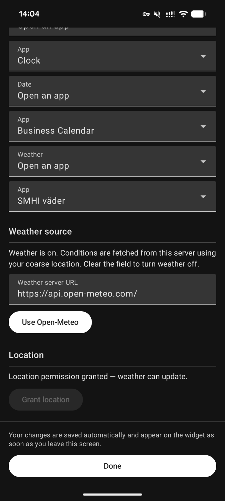
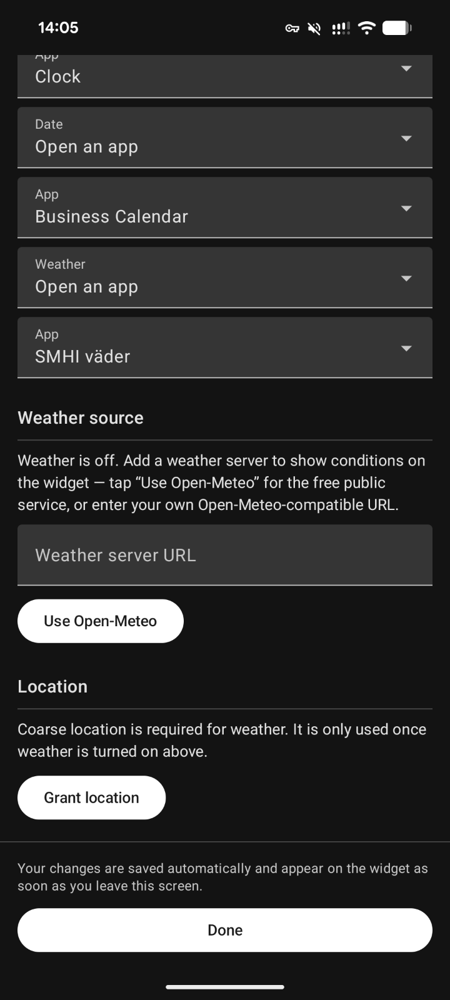

# BinClockWidget

<!-- Project Status & Distribution -->
[](https://www.gnu.org/licenses/gpl-3.0)


<!-- CI/CD & Quality Checks -->
[](https://github.com/shining-cat/binary-clock-widget/actions/workflows/android-verifications.yml)
[](https://github.com/shining-cat/binary-clock-widget/actions/workflows/android-verifications.yml)
[](https://github.com/shining-cat/binary-clock-widget/issues?q=is%3Aissue+is%3Aopen+label%3Adeprecations)

<!-- Standards & Compliance -->
[](https://pinterest.github.io/ktlint/)

An AMOLED-black, monochrome **binary-clock** Android home-screen widget.

It renders the current time and date as a 6×4 grid of dots. Cells that would
otherwise go unused carry a couple of small extras: the device **alarm state**
and **weather** glyphs. A slim **battery indicator** sits between the minutes
and day rows. The aesthetic is deliberately austere — solid dots on true black,
no chrome, no colour — so it disappears into an AMOLED wallpaper and sips
battery.

Weather is **opt-in and off by default**: the clock, date, alarm and battery all
work out of the box, and the app makes no network or location calls until you
turn weather on and point it at a server. See [Weather](#weather) for details.

## Screenshots

<p align="center">
  
</p>

The widget with weather turned off — no weather glyph, since weather is opt-in:

<p align="center">
  
</p>

Configuration — appearance, and turning weather on or off:

<p align="center">
  
  
  
</p>

## How to read it

The face is a grid of **rows** (values) and **columns** (place values):

- **Rows** encode, top to bottom: **hours**, **minutes**, **day** (of month),
  **month**.
- **Columns** are binary place values: **32 · 16 · 8 · 4 · 2 · 1**.
- A **lit** (solid) dot means that place value is *on*; an unlit dot is *off*.
  Add the lit columns in a row to read that row's number.

For example, a minutes row with the `32`, `8`, and `2` dots lit reads
`32 + 8 + 2 = 42`.

### The corner glyphs

The cells not needed by the low-value ends of the shorter rows are reused for a
handful of glyphs — the **alarm state** and three **weather** readings. Each has
a fixed, always-reserved cell:

| Cell                                          | Glyph                                                                                    |
|-----------------------------------------------|------------------------------------------------------------------------------------------|
| Hours row · leftmost column (the unused `32`) | **Alarm state** — a lit alarm clock when one is scheduled, an "alarm off" icon otherwise |
| Day row · leftmost column (the unused `32`)   | **Weather now** — current conditions, day/night aware                                    |
| Month row · leftmost column (the unused `32`) | **Weather today** — the day's forecast                                                   |
| Month row · second column (the unused `16`)   | **Weather tomorrow** — the next day's forecast                                           |

Those cells are free because the hours row never needs the `32` place (hours only
reach 23), the day row never needs it (days only reach 31), and the month row
needs only the low four places (months only reach 12) — so a glyph there can
never collide with a lit time/date bit.

The three weather glyphs cluster in the bottom-left: **current conditions** on
the day row, with **today's** and **tomorrow's** forecast side-by-side on the
month row just below. Only the "now" glyph is day/night aware — its sun becomes a
moon after dark; the two forecast glyphs always use their daytime icon. The
conditions map to Material Symbols icons — clear, partly cloudy, overcast, fog,
drizzle, rain, rain showers, snow, snow showers, and thunderstorm. When weather
is off, or no forecast has been fetched yet, those cells are simply empty — no
placeholder glyph.

### Battery indicator

Between the minutes and day rows sits a battery readout that's always on. It has
two parts, both in the icon tone:

- A **level gauge** spanning the first five columns: a hollow, capsule-shaped
  track filled left→right in proportion to the charge (a full track is 100%).
  The track's centre is genuinely transparent, so a translucent-background
  widget shows the wallpaper through it.
- A **state glyph** in the sixth column, which only appears when there's
  something to say. One glyph at a time:

  | Glyph | Meaning |
  |-------|---------|
  | ⚡ bolt | Charging (at any level — charging always wins) |
  | △ outline triangle | Low: 20% or less, discharging |
  | ▲ filled triangle | Very low: 10% or less, discharging |
  | *(empty)* | Above 20% and discharging — gauge only |

The escalation reads as one shape getting "louder": hollow at low, solid at very
low. The bolt is a distinct shape so charging is never confused with a warning.
There's deliberately no charging-speed distinction and no colour — see the
[design notes](#the-battery-glyph-is-a-warning-not-a-battery) below.

## Weather

Weather is **opt-in and off by default**. Until you point the app at a weather
server it makes no network or location calls and shows no weather glyphs — the
clock, date, alarm and battery all work regardless.

To turn it on, open settings and either tap **Use Open-Meteo** for the free,
keyless public [Open-Meteo](https://open-meteo.com) service
(`https://api.open-meteo.com/`), or enter your own **Open-Meteo-compatible**
endpoint — for example a [self-hosted Open-Meteo instance](https://github.com/open-meteo/open-meteo).
Clear the field to turn weather back off.

The endpoint must speak Open-Meteo's API: the app calls `/v1/forecast` and reads
the WMO `weather_code` values it returns. Any server mirroring that contract
works; an arbitrary weather API will not. This is why the setting is a server
URL, not a free choice of provider.

Once enabled, weather uses two permissions:

- **INTERNET** — to reach the weather server you configured.
- **Coarse location** (`ACCESS_COARSE_LOCATION`) — to fetch conditions for where
  you are. Location is read via the platform `LocationManager` only (no fused or
  Google Play location), and your coordinates are sent only to the server you
  configured, only while weather is on.

## Refresh cadence

Changes you make in **settings** (colours, tap actions) apply as soon as you
leave the screen — the widget is redrawn on exit. Turning **weather on or off**
is the exception: it changes what the widget fetches rather than how it draws, so
the weather glyphs appear or clear on the next refresh tick (below), not the
moment you leave settings.

The **live signals** the widget observes — the **alarm state**, the **battery
indicator** (both the gauge and its glyph), and the **weather** glyphs — update
on the widget's own refresh tick, roughly once a minute. Glance compiles to
`RemoteViews`, which has no way to react to an event the instant it fires, so
plugging in the charger, or turning weather off, can take up to a refresh cycle
to show. This is expected, not a bug.

## Design notes

### Alarm glyph mirrors the OS

The alarm glyph lights whenever the platform reports a scheduled alarm
(`AlarmManager.nextAlarmClock() != null`) — the same signal that drives the
system status-bar alarm icon. We deliberately do **not** try to filter it.

Automation and routine features (for example **Samsung Modes & Routines**)
schedule via `setAlarmClock()` exactly like a real alarm, so they can light the
glyph even when you didn't set a "real" alarm. It's tempting to filter these out
by the scheduling app's package, but the public API only exposes the *soonest*
alarm with no way to look past it — so any such filter risks the far worse
failure of **hiding a genuine alarm** that happens to sit behind a routine one.
Mirroring the OS is the honest best-effort a normal app can make.

Note that an OEM status bar may appear to filter these internally; it has
privileged access to the alarm database that third-party apps do not, so its
behaviour can't be reliably reproduced through the public API.

### The battery glyph is a warning, not a battery

The glyph beside the gauge is pure warning semantics — an alert triangle or a
charging bolt — never a little battery outline. The gauge already owns the
battery metaphor; a mini-battery next to it would just say the same thing twice.
So the glyph stays quiet until the charge is low enough to matter, then speaks in
warning shapes only.

There's no slow/normal/fast charging distinction: Android can't report charge
rate reliably in a once-a-minute widget (`BATTERY_PROPERTY_CURRENT_NOW` is noisy
or unsupported on many devices, and plug type is only a coarse proxy), so a
single "charging" bolt is the honest signal. And there's no colour — any hue
would collide with Material You or the user's own colour pick, and the whole face
is deliberately monochrome.

## Tech stack

- **Kotlin**
- **Jetpack Glance** (`glance-appwidget`) for the widget UI
- **Koin** for dependency injection
- **DataStore** for settings + weather caching
- **Retrofit / OkHttp / kotlinx.serialization** for networking
- **WorkManager** for periodic weather refresh
- **Open-Meteo** as the weather data source (keyless, FOSS-friendly)

## Distribution

BinClockWidget targets **F-Droid**: it is 100% FOSS and contains **no Google
Play Services, no Firebase, and no proprietary SDKs**. Its one optional network
feature is [Weather](#weather) — opt-in, off by default, and backed by the
keyless Open-Meteo API or your own self-hosted server.

## Build

```bash
./gradlew :app:assembleDebug
```

Requirements: JDK 21, Android SDK with platform 37 installed.

- **minSdk** 26
- **compileSdk / targetSdk** 37

## License

BinClockWidget is free and open-source software licensed under the
[GNU General Public License v3.0](LICENSE).

```
SPDX-License-Identifier: GPL-3.0-or-later
```

You're free to use, modify, and distribute this software, but any derivative
works must also be open source under GPL-3.0-or-later.
